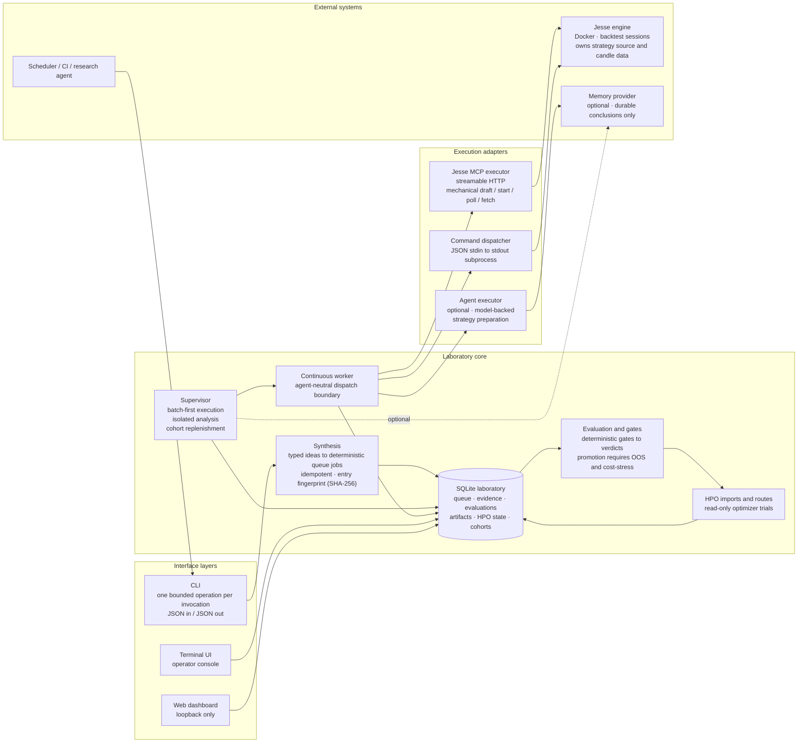
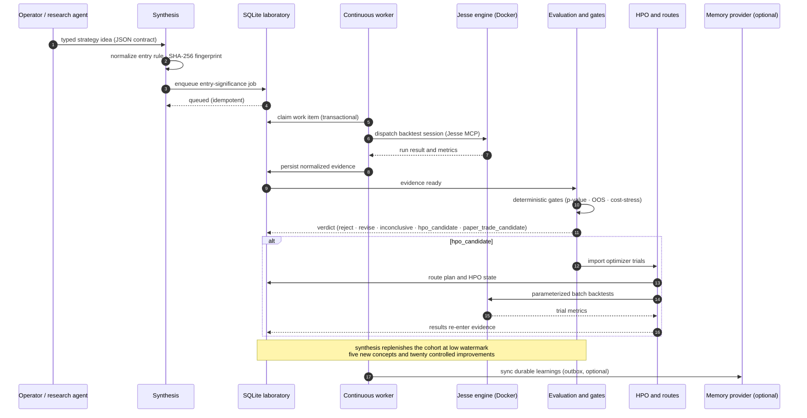
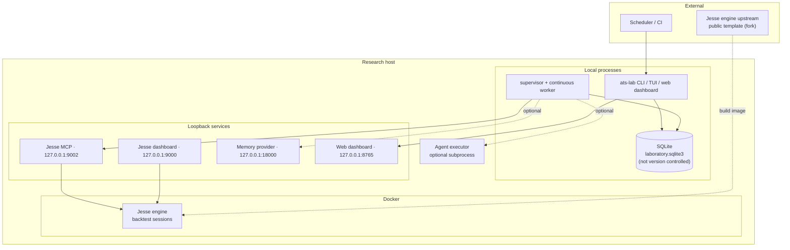

# Algorithmic Trading Strategy Laboratory

A typed, evidence-first workflow for algorithmic trading strategy research.

ATS Lab runs strategy research as reproducible batches: a strategy idea is
turned into typed JSON contracts, backtests execute inside the [Jesse]
framework, results are normalized into a SQLite evidence store, deterministic
gates produce research verdicts, and surviving candidates move through
hyperparameter optimization (HPO) and validation.

ATS Lab is **research and backtesting only**. It does not trade live, does not
manage exchange credentials, and does not guarantee profitable strategies.
Backtest results are not financial advice.

[Jesse]: https://jesse.trade/

## Features

- **Evidence-first workflow** — every backtest run is normalized into a single
  canonical evidence store; ranking, gating, analysis and dashboards all read
  the same rows.
- **SQLite as sole authority** — the queue, runs, evaluations, HPO state and
  synthesis cohorts live in one transactional database. No markdown or JSON
  sidecars are authoritative.
- **Deterministic gates** — statistical significance, out-of-sample and
  cost-stress checks decide `reject` / `revise` / `hpo_candidate` /
  `paper_trade_candidate` verdicts, not vibes.
- **Batch-first supervisor** — executes research in bounded batches (default
  8 jobs per executor turn), analyzes each completed batch once, and replenishes
  the research cohort at a low watermark.
- **Jesse via MCP** — the backtesting engine runs in Docker and is driven
  through its MCP endpoint; the laboratory never touches strategy source or
  candle data.
- **HPO lifecycle** — import read-only optimizer trials, route studies to
  training/OOS/rolling splits, validate selected trials, and promote only on
  genuine evidence.
- **Three operator surfaces** — CLI, interactive terminal UI/console, and a
  loopback-only web dashboard.
- **Crash-safe** — durable control intent, heartbeat-based execution claims,
  stale-claim recovery and restart-resume; a killed supervisor can be restarted
  with one command.
- **Auditable** — every resolution, requeue and operator action is recorded as
  a durable event.

## Architecture

High-level component view: typed JSON contracts flow from the interface layers
into a transactional queue; execution adapters isolate the backtesting
framework; deterministic gates and evaluation produce research verdicts.



Ownership boundaries:

- The laboratory owns specifications, queue state, evidence, evaluations and views.
- Execution adapters own communication with the backtesting framework.
- The continuous worker claims work and calls an external JSON adapter; it
  does not contain backtester or agent operations.
- A memory provider may store durable preferences and conclusions, never
  locks or authoritative experiment results.
- Markdown and HTML are output formats, not operational databases.

Canonical diagram source: [`docs/diagrams/architecture.md`](docs/diagrams/architecture.md).

## Repository layout

| Path | Purpose |
|---|---|
| `src/ats_lab/` | Laboratory code: CLI, supervisor, workers, gates, adapters |
| `tests/` | Unit test suite (Python `unittest`) |
| `docs/` | User, operator and design documentation |
| `docs/diagrams/` | Mermaid diagrams rendered on GitHub |
| `scripts/` | Jesse workspace helper scripts |
| `.ats-lab/config.toml` | Local configuration (gitignored; see `.ats-lab/config.toml.example`) |

The Jesse strategy source and candle data live in a separate research
workspace (see [Setup](#setup)); the laboratory only talks to the engine
through its MCP endpoint.

## Prerequisites

| Requirement | Needed for | Notes |
|---|---|---|
| Python 3.11+ | ATS Lab itself | |
| Docker | Jesse backtesting engine | Engine runs in a container |
| Jesse research workspace | Backtests | Owns strategies, routes and candle data |
| Jesse dashboard + MCP | Backtest execution and inspection | `127.0.0.1:9000` and `127.0.0.1:9002/mcp` |
| Agent executor binary | Analysis / synthesis turns | Optional — execution-only mode works without it |
| Memory provider | Durable research conclusions | Optional — `127.0.0.1:18000` health API |

## Quick start

```bash
git clone https://github.com/l-j-g/algorithmic-trading-strategy-laboratory.git
cd algorithmic-trading-strategy-laboratory

python3 -m venv .venv
source .venv/bin/activate
python3 -m pip install -e .
ats-lab init
```

`ats-lab init` creates the local database and configuration skeleton. Then
copy the example config and point it at your Jesse workspace:

```bash
cp .ats-lab/config.toml.example .ats-lab/config.toml
# edit .ats-lab/config.toml: [repositories].jesse -> your Jesse research workspace
```

Check that everything the supervisor needs is reachable:

```bash
PYTHONPATH=src python3 -m ats_lab.cli preflight
```

Run one supervisor round (see [Setup](#setup) for the full environment):

```bash
ats-lab supervisor
```

From any directory, the installed CLI discovers the canonical checkout
automatically:

```bash
ats-lab
```

This shows current health, supervisor state, queue, memory, and one exact next
command.

## Setup

### Local configuration

Local configuration lives at `<repo-root>/.ats-lab/config.toml` (gitignored).
Start from the committed example:

```bash
cp .ats-lab/config.toml.example .ats-lab/config.toml
```

The example documents every option. The essential sections:

```toml
[repositories]
jesse = "/absolute/path/to/jesse-research-workspace"

[executor]
# Agent executor CLI used for analysis/synthesis batches (optional in
# execution-only mode). Provide a binary name on PATH or an absolute path.
executable = "executor"
timeout_seconds = 3600

[resources]
mode = "compute_heavy"
execution_batch_size = 8
active_ready_limit = 8
```

Recommended token-efficient settings:

- execute 8 jobs per executor turn;
- analyze a completed batch once;
- generate 25 chains per synthesis turn;
- refill at 5 remaining chains;
- require at least 5 new concepts per synthesis round.

### Jesse workspace

The research workspace owns strategies, routes, config and candle data. A
helper script manages the upstream engine checkout and Docker stack:

```bash
scripts/jesse-workspace.sh status
scripts/jesse-workspace.sh upstream update
scripts/jesse-workspace.sh image build
scripts/jesse-workspace.sh stack up
scripts/jesse-workspace.sh stack up --no-update  # deliberate pinned/offline start
```

`stack up` polls the public upstream first, then starts Jesse from the
commit-tagged immutable image. The default upstream checkout is
`<workspace-root>/jesse-upstream`; override with `JESSE_UPSTREAM_REPOSITORY`
when needed. Do not use `salehmir/jesse:latest` for a research run when commit
provenance matters.

For recurring polling while the stack is not being restarted, schedule
`scripts/jesse-workspace.sh upstream refresh`. It fast-forwards the public
mirror and builds only when the corresponding commit-tagged image is absent.

`scripts/jesse-workspace.sh status` also compares the running `jesse` container's
image and OCI revision label with the clean upstream target. A running mismatch
is an explicit `transitional_exception`, not a provenance match; preserve the
active batch and run the controlled `stack up` restart/rebuild only afterward.

### Environment variables

| Variable | Default | Purpose |
|---|---|---|
| `ATS_LAB_WORKER_ID` | `ats-lab-supervisor` (supervisor/worker commands) | Worker identity used for execution claims and heartbeats |
| `ATS_LAB_MEMORY_URL` | — | Base URL of the optional memory provider |
| `ATS_LAB_MEMORY_API_KEY` | — | API key for the memory provider |
| `ATS_LAB_MEMORY_WORKSPACE` | `ats-lab-memory` | Memory provider workspace id |
| `ATS_LAB_MEMORY_PEER` | `ats-lab-memory-peer` | Memory provider peer id |
| `ATS_LAB_MEMORY_SESSION` | — | Memory provider session id |
| `ATS_LAB_MEMORY_HEALTH_URL` | `http://127.0.0.1:18000/health` | Memory provider health endpoint checked by preflight |
| `JESSE_UPSTREAM_REPOSITORY` | `<workspace-root>/jesse-upstream` | Clean public Jesse engine checkout used to build the Docker image |
| `JESSE_RESEARCH_REPOSITORY` | `<workspace-root>/jesse-src` | Research workspace owning strategies and candles |

Keep credentials in the process environment only — never in tracked config
files or command output.

## Data flow

One research-loop iteration: a typed strategy idea becomes deterministic queue
jobs, backtests run inside the Jesse engine, normalized evidence feeds
deterministic gates, and a verdict routes the candidate to rejection,
revision, HPO, or promotion.



Gate behavior:

- `p_value < 0.05`: baseline becomes ready.
- `0.05 <= p_value <= 0.10`: baseline stays scheduled as inconclusive.
- `p_value > 0.10`: baseline is archived.
- Promotion to `paper_trade_candidate` requires positive out-of-sample or
  rolling evidence and an explicit passing cost-stress result. Missing
  validation is `inconclusive`; failed validation is `reject`.

Canonical diagram source: [`docs/diagrams/data-flow.md`](docs/diagrams/data-flow.md).

## Usage

### Daily operation

```bash
ats-lab            # health, supervisor state, queue, one next command
ats-lab doctor     # infrastructure + workflow checks
ats-lab next       # exact recommended next action
ats-lab monitor    # one snapshot
ats-lab monitor --watch            # refresh every 5 s
ats-lab monitor --watch --interval 2
ats-lab tui        # interactive terminal UI (press ? for keys, q to exit)
```

### Supervisor

One supervisor round:

```bash
ats-lab supervisor
```

Inspect the plan before starting (read-only):

```bash
ats-lab supervisor --plan
```

Continuous operation:

```bash
ats-lab loop start
ats-lab loop status
ats-lab loop pause
ats-lab loop stop
```

Bounded continuous run:

```bash
ats-lab supervisor --continuous --max-rounds 3
```

Supervisor finishes the current execution plus required analysis, then exits
before claiming another batch. Completed run evidence stays durable. Restart
after a graceful stop with `ats-lab loop start`.

### Control

```bash
ats-lab control status
ats-lab control pause     # pause before pending analysis; claim no new work
ats-lab control resume
ats-lab control stop      # finish current batch + analysis, exit before next claim
```

Control state lives in canonical SQLite — reopening a terminal does not lose
it. `stop` remains requested until `resume`; run `resume` before starting
another supervisor.

### Evidence

```bash
ats-lab evidence
ats-lab evidence --symbol BTC-USDT --timeframe 1h --split oos --rank sharpe_ratio
ats-lab evidence --format json
ats-lab diagnostic-export RUN-ID            # raw diagnostics, one known run
ats-lab diagnostic-hpo-trial HPO-STUDY-ID TRIAL-NUMBER
```

Every completed run is normalized immediately into SQLite; multi-route runs
become one row per atomic route and evidence split. Missing values display as
`—`. Use `diagnostic-*` only for debugging — never for ranking, gating or
monitoring.

### Queue and candidates

```bash
ats-lab queue
ats-lab queue --state ready
ats-lab queue --state blocked
ats-lab queue --format json
ats-lab candidates
ats-lab candidates --verdict hpo-candidate
ats-lab candidates --format json
```

### HPO lifecycle

```bash
ats-lab hpo
ats-lab hpo-detail HPO-STUDY-ID
ats-lab analyzer
ats-lab timings
ats-lab timings --job HPO-WORK-ITEM-ID
ats-lab requeue-hpo-analysis HPO-ANALYSIS-JOB-ID --reason "provider or transport blocker repaired"
```

Lifecycle labels: `hpo_candidate` → `hpo_scheduled` → `hpo_running` →
`hpo_analysis` → `validation` → `paper_trade_candidate` (or `revise` /
`reject`). `hpo-detail` shows study objective, trial progress, validation
status and normalized evidence links — it never prints raw optimizer JSON.

Validation routes are supplied as JSON without editing SQLite:

```bash
ats-lab configure-hpo-validation-routes OPTUNA-9BD60A3E3546 --file validation-routes.json
```

For a quick local bootstrap, `ats-lab hpo-defaults` previews (and
`--apply` applies) a conservative disjoint BTC-USDT 1h policy; explicit route
files always take precedence.

### Manual experiment enqueue

Normal operation uses synthesis, but operator-created work is supported:

```bash
ats-lab enqueue --file experiment.json
```

```json
{
  "schema_version": 1,
  "experiment": {
    "id": "BTC-TREND-001",
    "strategy_name": "ExampleTrendStrategy",
    "experiment_type": "baseline",
    "hypothesis": "A volatility-filtered trend entry persists after fees.",
    "archetype": "trend",
    "target_regime": "directional expansion",
    "failure_regime": "low-volatility chop",
    "routes": [{
      "exchange": "Binance Perpetual Futures",
      "symbol": "BTC-USDT",
      "timeframe": "1h",
      "start_date": "2024-01-01",
      "finish_date": "2024-12-31"
    }]
  },
  "work_item": {
    "id": "BTC-TREND-001",
    "experiment_id": "BTC-TREND-001",
    "priority": 20,
    "state": "ready",
    "dependencies": []
  }
}
```

### Audit

```bash
ats-lab audit
ats-lab synthesis-status
```

Healthy audit expectations:

- `finished_missing_evaluation: 0`;
- `unknown_strategy: 0`;
- no unexplained running claim;
- no completed batch left unevaluated indefinitely.

## Work states and verdicts

```text
scheduled -> ready -> running -> finished
                         |
                         +-> waiting_retry -> ready
                         |
                         +-> failed run -> analysis -> finished
                         |
                         +-> blocked (operator requirement only)
```

| State | Meaning |
|---|---|
| `scheduled` | Future work waiting for dependency or ready capacity |
| `ready` | May be claimed by supervisor |
| `running` | Claimed execution or completed run awaiting batch analysis |
| `waiting_retry` | Transient failure with bounded backoff |
| `blocked` | External constraint or explicit human decision required |
| `finished` | Execution and evaluation durable |
| `archived` | Terminal history, not future work |

Verdicts: `reject`, `revise`, `inconclusive`, `pass`, `hpo_candidate`,
`paper_trade_candidate`, `infrastructure_failure`.

Execution completion and research verdict are separate facts: poor metrics and
terminal harness failures both reach evaluation.

## Troubleshooting

### Preflight fails

`ats-lab preflight` checks Docker, the Jesse PostgreSQL container, the Jesse
dashboard (`127.0.0.1:9000`) and MCP (`127.0.0.1:9002/mcp`), and the memory
provider health API (`127.0.0.1:18000/health`). If the gate fails:

- start the Jesse stack: `cd "$JESSE_RESEARCH_REPOSITORY/docker" && docker compose up`
- start the memory provider, or override only its URL with
  `ATS_LAB_MEMORY_HEALTH_URL` (keep credentials in the environment);
- re-run `preflight` before starting the supervisor.

Failure returns `infrastructure_preflight_failed` without consuming strategy
attempts.

### Stale execution claim

Preview first:

```bash
ats-lab recover-claims --stale-after-hours 2
```

Apply only when the preview shows abandoned claims with no durable runs:

```bash
ats-lab recover-claims --stale-after-hours 2 --apply
```

Completed executions awaiting analysis are excluded from stale-claim recovery.

### Analyzer failure

Do not rerun backtests manually — restart the same supervisor:

```bash
ats-lab supervisor
```

It finds durable runs marked `awaiting_batch_evaluation` and resumes analysis.

### Blocked work item

Inspect the exact blocker:

```bash
ats-lab queue --state blocked
```

Do not blindly return blocked work to ready. Resolve the requirement, accept
an explicit research assumption, or archive with terminal evidence. After
fixing the root cause, reopen with durable evidence:

```bash
ats-lab resolve-blocker JOB-ID \
  --code sizing_fix_validated \
  --detail "Exact validated resolution." \
  --evidence JESSE-SESSION-ID
```

If durable run metrics exist but analyzer evidence was incomplete:

```bash
ats-lab requeue-evaluation JOB-ID \
  --batch RECOVERY-ID \
  --reason "Recover existing durable metrics."
```

This schedules analysis only — it never reruns Jesse execution.

### HPO analysis parked as `hpo_trials_required`

Scheduled HPO execution does not invent trial rows. If the optimizer returns a
completed run without durable trial/import evidence, ATS Lab parks analysis
with `hpo_trials_required` and readiness `requirements_pending`. Import a
completed Optuna study or a versioned, complete Jesse per-trial session export
through the HPO import workflow, then resume the resulting `hpo_analysis` job.
Jesse dashboard `best_candidates` summaries remain partial and are rejected.

### Database audit or migration concern

Preview only:

```bash
ats-lab reconcile
ats-lab sanitize
```

Before applying sanitation, back up:

```bash
cp .ats-lab/laboratory.sqlite3 .ats-lab/laboratory.sqlite3.backup
```

Then, only after reviewing the preview:

```bash
ats-lab sanitize --apply
```

## Testing

```bash
PYTHONPATH=src python3 -m unittest discover -s tests
git diff --check
```

## Contributing

1. Fork the repository and create a feature branch (or use a git worktree).
2. Set up a development environment:
   ```bash
   python3 -m venv .venv
   source .venv/bin/activate
   python3 -m pip install -e .
   ```
3. Make focused changes with descriptive commit messages. Do not commit
   unrelated or pre-existing changes.
4. Add tests for new behavior — the suite is `unittest` under `tests/`.
5. Run the full suite and the whitespace check:
   ```bash
   PYTHONPATH=src python3 -m unittest discover -s tests
   git diff --check
   ```
6. Verify infrastructure assumptions with `ats-lab preflight` if your change
   touches execution or the supervisor.
7. Open a pull request describing the change and the evidence it was verified
   against.

Guidelines:

- The laboratory owns specs, queue state and evidence — keep new features
  consistent with the single-SQLite-authority model.
- `NormalizedEvidence` is the sole metric contract. `CandidateMetrics` is an
  alias, not another schema.
- Never commit runtime databases, Docker volumes, `.env` files, private
  strategy source, or generated backtest artifacts.
- Never read or print credential values.
- Keep the dashboard loopback-only; it has no authentication.
- Research-only: no live order placement, no exchange credentials in the
  codebase.

See [`AGENTS.md`](AGENTS.md) for the project workflow and
[`docs/maintainability.md`](docs/maintainability.md) for design conventions.

## Deployment

The laboratory runs as local processes on a single research host with a SQLite
file database; the Jesse backtesting engine runs in Docker. All service
endpoints bind to loopback. An optional agent executor and memory provider sit
beside the core; a scheduler or CI may invoke the CLI.



Data placement:

- SQLite stores experiment specifications, work items, runs, evaluations,
  artifacts, events and synthesis cohorts — never candle data or strategy
  source.
- The Jesse workspace owns strategy source and candle data; the engine image
  is built from the public upstream template.
- Optional memory storage holds durable preferences and conclusions only.

Canonical diagram source: [`docs/diagrams/deployment.md`](docs/diagrams/deployment.md).

## Dashboard

Start the web dashboard on a separate terminal (loopback only — it has no
authentication):

```bash
ats-lab dashboard --host 127.0.0.1 --port 8765
```

Open <http://127.0.0.1:8765>. Jesse's own dashboard stays available at
<http://127.0.0.1:9000> for inspecting individual backtest sessions.

## Reference documentation

- Architecture: [`docs/architecture.md`](docs/architecture.md)
- Operator dashboard: [`docs/operator-dashboard.md`](docs/operator-dashboard.md)
- Resource policy: [`docs/resource-policy.md`](docs/resource-policy.md)
- Synthesis: [`docs/synthesis.md`](docs/synthesis.md)
- Agent launcher: [`docs/agent-launcher.md`](docs/agent-launcher.md)
- Jesse integration: [`docs/workspace-integration.md`](docs/workspace-integration.md)
- Migration and cleanup: [`docs/migration-and-cleanup.md`](docs/migration-and-cleanup.md)
- Terminal UI: [`docs/terminal-ui.md`](docs/terminal-ui.md)
- Web interface: [`docs/web-interface.md`](docs/web-interface.md)
- Research memory: [`docs/research-memory.md`](docs/research-memory.md)
- Jesse research policy: [`docs/jesse/BACKTEST_EVALUATION_PROTOCOL.md`](docs/jesse/BACKTEST_EVALUATION_PROTOCOL.md) and [`docs/jesse/STRATEGY_CONCEPT_PLAYBOOK.md`](docs/jesse/STRATEGY_CONCEPT_PLAYBOOK.md)
- Dynamic leverage research brief: [`research/briefs/dynamic-leverage-allocation.md`](research/briefs/dynamic-leverage-allocation.md)
- Diagrams: [`docs/diagrams/`](docs/diagrams/)

## Safety

- Research/backtesting only.
- No live order placement.
- No exchange credentials in ATS Lab.
- Keep dashboard bound to `127.0.0.1`.
- Preserve licensed/private strategy-source boundaries.
- Backtests are not financial advice and do not guarantee future performance.

## License

MIT. See [`LICENSE`](LICENSE).
