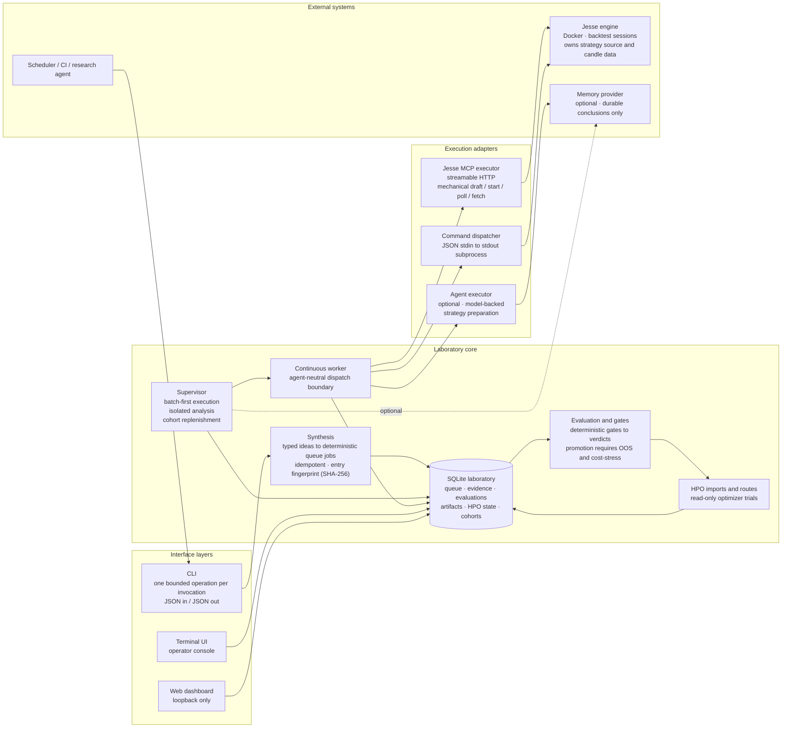

# Architecture

High-level component view of the Algorithmic Trading Strategy Laboratory.
Typed JSON contracts flow from the interface layers into a transactional
queue; execution adapters isolate the backtesting framework; deterministic
gates and evaluation produce research verdicts.

## Ownership boundaries

- The laboratory owns specifications, queue state, evidence, evaluations and views.
- Execution adapters own communication with the backtesting framework.
- The continuous worker claims work and calls an external JSON adapter; it
  does not contain backtester or agent operations.
- A memory provider may store durable preferences and conclusions, never
  locks or authoritative experiment results.
- Markdown and HTML are output formats, not operational databases.
