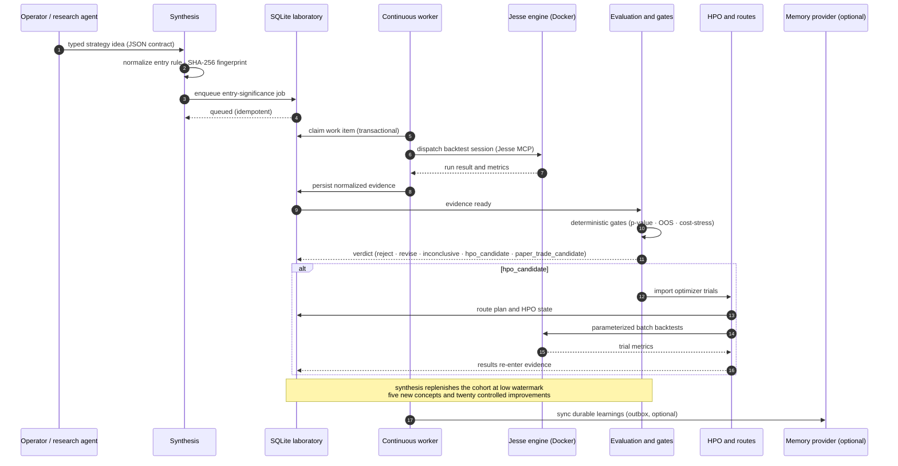

# Data flow

One research-loop iteration: a typed strategy idea becomes deterministic queue
jobs, backtests run inside the Jesse engine, normalized evidence feeds
deterministic gates, and a verdict routes the candidate to rejection,
revision, HPO, or promotion.

## Gate behavior

- `p_value < 0.05`: baseline becomes ready.
- `0.05 <= p_value <= 0.10`: baseline stays scheduled as inconclusive.
- `p_value > 0.10`: baseline is archived.
- Promotion to `paper_trade_candidate` requires positive out-of-sample or
  rolling evidence and an explicit passing cost-stress result. Missing
  validation is `inconclusive`; failed validation is `reject`.

## State machines

Work state: `scheduled -> ready -> running -> finished`, with retry, failure
evidence, and operator-requirement branches.

Verdicts: `reject | revise | inconclusive | hpo_candidate | paper_trade_candidate`.

Execution completion and research quality are intentionally independent:
poor metrics and terminal harness failures both reach evaluation.
