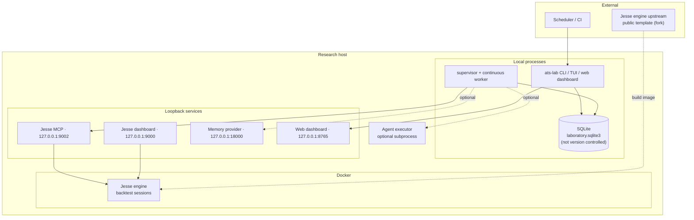

# Deployment model

The laboratory runs as local processes on a single research host with a
SQLite file database; the Jesse backtesting engine runs in Docker. All
service endpoints bind to loopback. An optional agent executor and memory
provider sit beside the core; a scheduler or CI may invoke the CLI.

## Data placement

- SQLite stores experiment specifications, work items, runs, evaluations,
  artifacts, events and synthesis cohorts — never candle data or strategy
  source.
- The Jesse workspace owns strategy source and candle data; the engine image
  is built from the public upstream template.
- Optional memory storage holds durable preferences and conclusions only.
